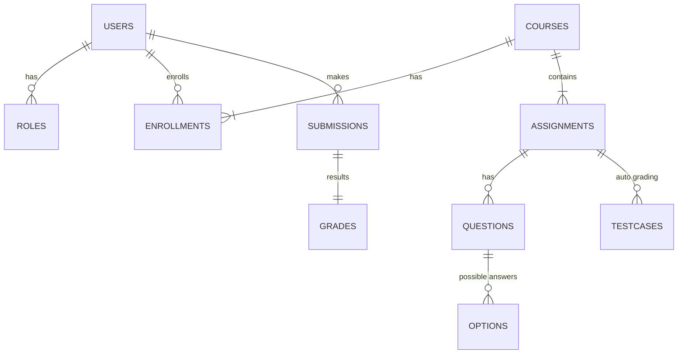

# Quizz MindX

This repository contains a bare skeleton for an online assignment and exam platform.  
It currently includes a basic Spring Boot project and documentation describing the target architecture.

## Entity Relationship Diagram


## API Overview
| Endpoint | Method | Description | Roles |
|----------|--------|-------------|-------|
| `/auth/register` | POST | Register new user | Public |
| `/auth/login` | POST | Login and receive JWT | Public |
| `/courses` | GET | List courses | STUDENT, INSTRUCTOR, ADMIN |
| `/courses` | POST | Create course | INSTRUCTOR, ADMIN |
| `/assignments/{id}/submissions` | POST | Submit answers or code | STUDENT |

## Directory Structure
```
.
├── quizz/            # Spring Boot backend
├── README.md         # Documentation and ERD
```

## Building
The Maven project requires internet access to download dependencies. Run tests with:
```
cd quizz/quizz
mvn test
```

Due to offline environment, dependencies may fail to download.

## Running with Docker
To start the PostgreSQL database and backend service run:
```bash
docker compose up -d --build
```
Backend will be available at http://localhost:8080.

Seed users:
- admin@example.com / password
- instructor@example.com / password
- student1@example.com / password
- student2@example.com / password
- student3@example.com / password

These accounts are inserted via `data.sql`.
